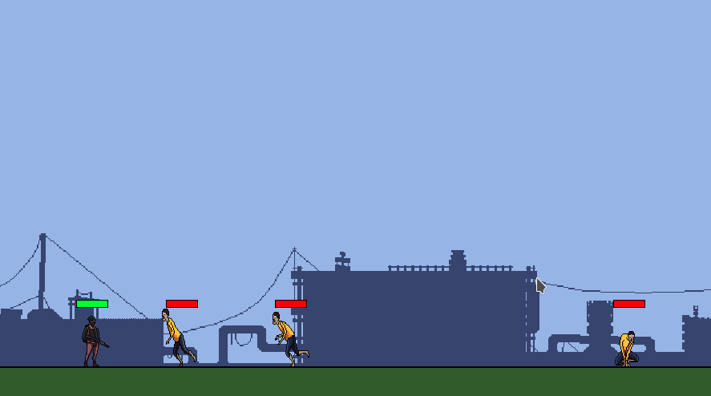

# ShooterGame2D
Prerequirements:
On Linux:
```bash
sudo apt install libsdl2-2.0-0 libsdl2-ttf-2.0-0 libsdl2-image-2.0-0
sudo apt-get install libsdl2-dev libsdl2-ttf-dev libsdl2-image-dev
```
On windows, working on finding the correct dll files


WASD for movement. F for shoot, K for debug mode(basically shows rectangle overlay)  
Creating game in C like a chad


Look at [X](https://x.com/birajtwr) for gameplay of latest development
